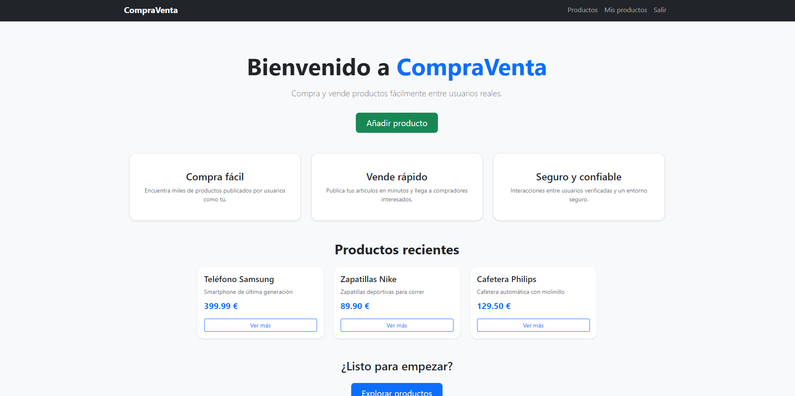
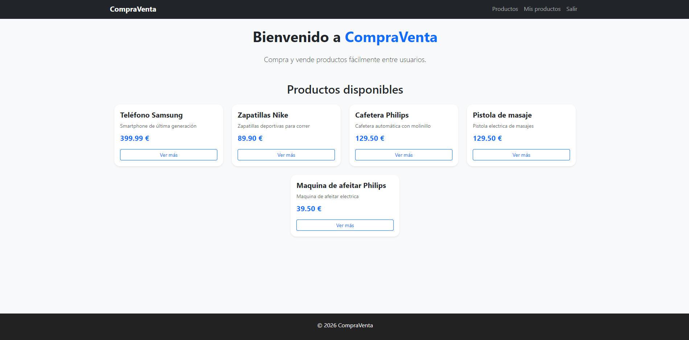
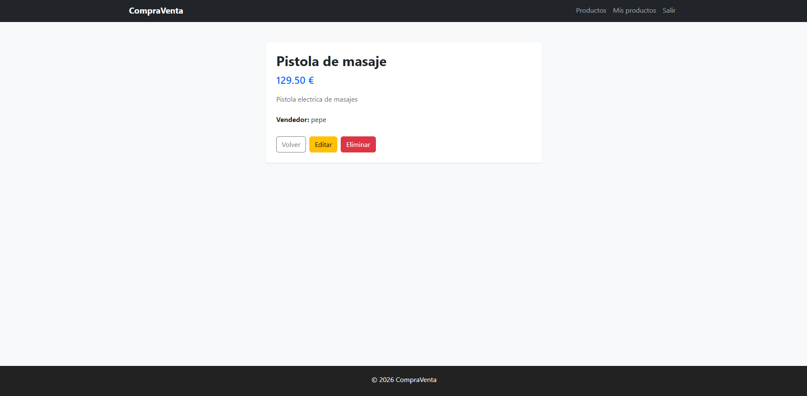
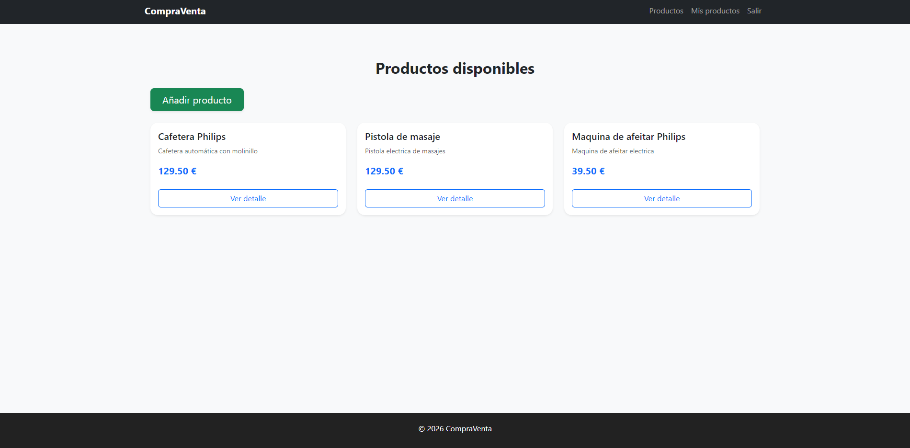
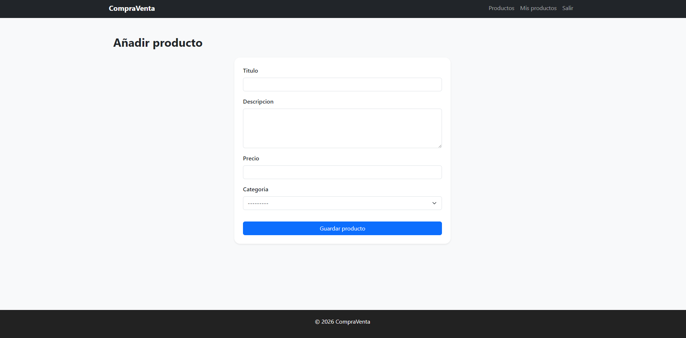
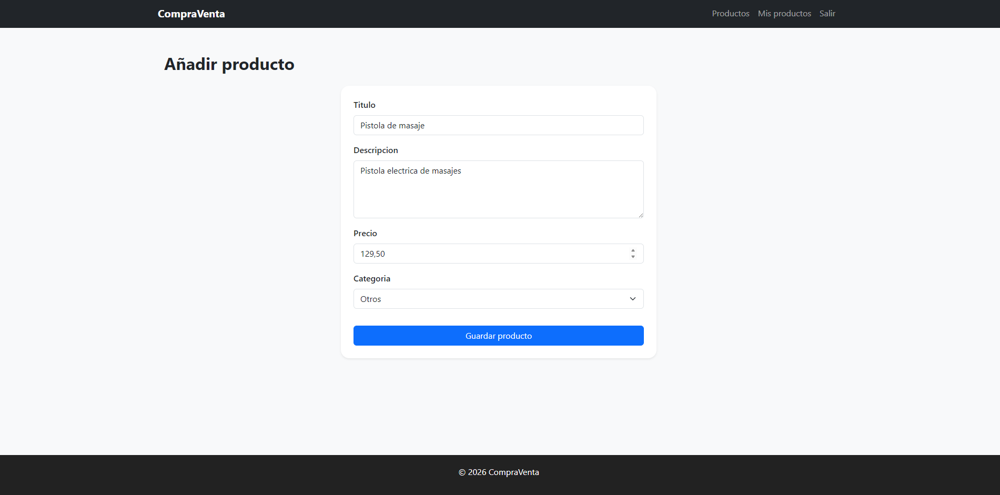
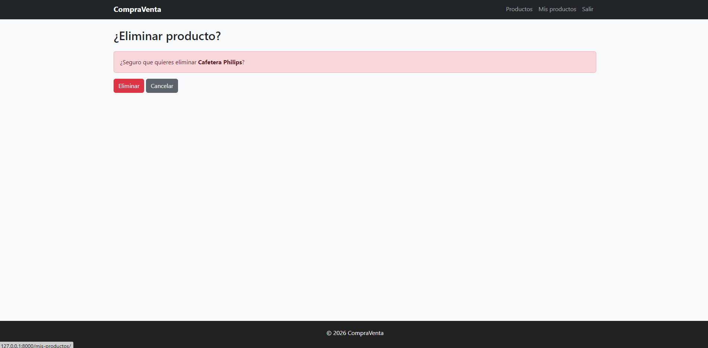

# 🛒 CompraVenta

[](https://www.python.org/)
[](https://www.djangoproject.com/)
[](https://getbootstrap.com/)
[](LICENSE)

**CompraVenta** es una plataforma web de compra-venta de productos entre usuarios, desarrollada con Django. Permite a los usuarios registrados publicar, gestionar y explorar productos organizados por categorías.

---

## 📋 Tabla de Contenidos

- [Características](#-características)
- [Tecnologías](#-tecnologías)
- [Estructura del Proyecto](#-estructura-del-proyecto)
- [Instalación](#-instalación)
- [Uso](#-uso)
- [Modelos de Datos](#-modelos-de-datos)
- [Vistas de la Aplicación](#-vistas-de-la-aplicación)
- [Funcionalidades](#-funcionalidades)
- [Capturas de Pantalla](#-capturas-de-pantalla)
- [Contribución](#-contribución)
- [Licencia](#-licencia)

---

## ✨ Características

- ✅ **Sistema de autenticación** completo (registro, login, logout)
- ✅ **Gestión de productos** (crear, leer, actualizar, eliminar - CRUD)
- ✅ **Categorización** de productos (Tecnología, Hogar, Moda, Deporte, Vehículos, Otros)
- ✅ **Validación de formularios** con mensajes de error personalizados
- ✅ **Diseño responsive** con Bootstrap 5
- ✅ **Panel de usuario** para gestionar productos propios
- ✅ **Listado público** de todos los productos disponibles
- ✅ **Vista detallada** de cada producto
- ✅ **Restricción de acceso** (solo el vendedor puede editar/eliminar sus productos)

---

## 🛠️ Tecnologías

### Backend
- **Python 3.8+**
- **Django 5.2.8** - Framework web
- **SQLite** - Base de datos

### Frontend
- **HTML5** y **CSS3**
- **Bootstrap 5.3.2** - Framework CSS
- **Bootstrap Icons** - Iconos

### Seguridad
- **CSRF Protection** habilitado
- **Django Authentication System**
- **Password Validators** configurados

---

## 📁 Estructura del Proyecto

```
compraVenta/
│
├── compraVenta/                # Configuración principal del proyecto
│   ├── __init__.py
│   ├── settings.py             # Configuración de Django
│   ├── urls.py                 # Rutas principales
│   ├── wsgi.py                 # Configuración WSGI
│   └── asgi.py                 # Configuración ASGI
│
├── productos/                  # Aplicación de productos
│   ├── migrations/             # Migraciones de base de datos
│   ├── templates/              # Plantillas HTML específicas
│   │   └── productos/
│   │       ├── index.html
│   │       ├── lista_productos.html
│   │       ├── detalle_producto.html
│   │       ├── mis_productos.html
│   │       ├── producto_form.html
│   │       └── producto_confirm_delete.html
│   ├── __init__.py
│   ├── admin.py                # Configuración del admin
│   ├── apps.py                 # Configuración de la app
│   ├── forms.py                # Formularios personalizados
│   ├── models.py               # Modelos de datos
│   ├── urls.py                 # Rutas de la aplicación
│   ├── views.py                # Lógica de vistas
│   └── tests.py                # Tests unitarios
│
├── templates/                  # Plantillas globales
│   ├── base.html               # Plantilla base
│   └── registration/
│       ├── login.html
│       └── logged_out.html
│
├── db.sqlite3                  # Base de datos SQLite
├── manage.py                   # Script de gestión de Django
└── README.md                   # Este archivo
```

---

## 🚀 Instalación

### Prerrequisitos
- Python 3.8 o superior
- pip (gestor de paquetes de Python)
- Git (opcional, para clonar el repositorio)

### Pasos de instalación

1. **Clonar el repositorio** (o descargar el ZIP)
   ```bash
   git clone https://github.com/tu-usuario/compraVenta.git
   cd compraVenta
   ```

2. **Crear un entorno virtual** (recomendado)
   ```bash
   python -m venv venv
   ```

3. **Activar el entorno virtual**
   - **Windows:**
     ```bash
     venv\Scripts\activate
     ```
   - **Linux/Mac:**
     ```bash
     source venv/bin/activate
     ```

4. **Instalar Django**
   ```bash
   pip install django
   ```

5. **Aplicar las migraciones**
   ```bash
   python manage.py migrate
   ```

6. **Crear un superusuario** (opcional, para acceder al admin)
   ```bash
   python manage.py createsuperuser
   ```

7. **Ejecutar el servidor de desarrollo**
   ```bash
   python manage.py runserver
   ```

8. **Acceder a la aplicación**
   - Aplicación: [http://127.0.0.1:8000/](http://127.0.0.1:8000/)
   - Panel de administración: [http://127.0.0.1:8000/admin/](http://127.0.0.1:8000/admin/)

---

## 💻 Uso

### Crear una cuenta
Actualmente, la aplicación no incluye formulario de registro público. Para crear usuarios:
- Usa el comando `createsuperuser` para crear un administrador
- Crea usuarios adicionales desde el panel de administración Django (`/admin/`)

### Publicar un producto
1. Inicia sesión con tu cuenta
2. Haz clic en "Añadir producto" desde la página principal
3. Completa el formulario con:
   - **Título** del producto
   - **Descripción** (mínimo 10 caracteres)
   - **Precio** (mayor que 0)
   - **Categoría**
4. Envía el formulario

### Gestionar tus productos
- Accede a "Mis productos" desde el menú de navegación
- Edita o elimina tus productos publicados
- Solo tú puedes modificar tus propios productos

### Explorar productos
- Navega por la lista completa en "Productos"
- Haz clic en cualquier producto para ver sus detalles completos

---

## 🗄️ Modelos de Datos

### Producto
Modelo principal que representa un artículo en venta.

```python
class Producto(models.Model):
    titulo = models.CharField(max_length=100)
    descripcion = models.TextField()
    precio = models.DecimalField(max_digits=10, decimal_places=2)
    categoria = models.CharField(max_length=20, choices=CATEGORIAS)
    vendedor = models.ForeignKey(User, on_delete=models.CASCADE)
```

**Categorías disponibles:**
- Tecnología
- Hogar
- Moda
- Deporte
- Vehículos
- Otros

### Categoría
Modelo para organizar productos (actualmente definido pero no utilizado activamente).

```python
class Categoria(models.Model):
    nombre = models.CharField(max_length=50, unique=True)
```

---

## 🌐 Vistas de la Aplicación

| Nombre                | URL                        | Descripción                                    | Autenticación |
|-----------------------|----------------------------|------------------------------------------------|---------------|
| Inicio                | `/`                        | Página principal con productos recientes       | No            |
| Lista de Productos    | `/productos/`              | Listado completo de todos los productos        | No            |
| Detalle de Producto   | `/producto/<id>/`          | Información detallada de un producto           | No            |
| Mis Productos         | `/mis-productos/`          | Productos del usuario autenticado              | Sí            |
| Nuevo Producto        | `/producto/nuevo/`         | Formulario para crear un nuevo producto        | Sí            |
| Editar Producto       | `/producto/<id>/editar/`   | Formulario para editar un producto propio      | Sí            |
| Eliminar Producto     | `/producto/<id>/eliminar/` | Confirmación para eliminar un producto propio  | Sí            |
| Login                 | `/login/`                  | Formulario de inicio de sesión                 | No            |
| Logout                | `/logout/`                 | Cerrar sesión                                  | Sí            |

---

## ⚙️ Funcionalidades

### Validaciones de Formularios

El formulario de productos incluye validaciones personalizadas:

- **Precio:**
  - Debe ser mayor que 0
  - Campo obligatorio

- **Descripción:**
  - Mínimo 10 caracteres
  - Campo obligatorio

- **Título:**
  - Máximo 100 caracteres

### Control de Acceso

- Los usuarios no autenticados pueden:
  - Ver la página principal
  - Explorar todos los productos
  - Ver detalles de productos

- Los usuarios autenticados pueden:
  - Crear nuevos productos
  - Editar sus propios productos
  - Eliminar sus propios productos
  - Ver su panel de "Mis productos"

### Diseño Responsive

- Diseño adaptado para dispositivos móviles, tablets y escritorio
- Navegación colapsable en pantallas pequeñas
- Grid flexible con Bootstrap

---

## 📸 Capturas de Pantalla

> [!NOTE]
> Las siguientes capturas muestran las diferentes vistas de la aplicación.

### Página Principal
_Aquí se mostrará la vista de inicio con productos destacados_



---

### Lista de Productos
_Vista de todos los productos disponibles con filtros por categoría_



---

### Detalle de Producto
_Información completa de un producto específico_


---

### Mis Productos
_Panel personal con los productos publicados por el usuario_



---

### Formulario de Nuevo Producto
_Interfaz para añadir un nuevo producto a la venta_



---

### Formulario de Edición
_Interfaz para modificar un producto existente_



---

### Confirmación de Eliminación
_Pantalla de confirmación antes de eliminar un producto_


---

### Página de Login
_Formulario de inicio de sesión_

<!-- Insertar captura de pantalla del login -->

---

### Vista Responsive (Mobile)
_Diseño adaptado para dispositivos móviles_

<!-- Insertar captura de pantalla en modo móvil -->

---

## 🤝 Contribución

Las contribuciones son bienvenidas. Para proponer cambios:

1. Fork el proyecto
2. Crea una rama para tu feature (`git checkout -b feature/NuevaCaracteristica`)
3. Haz commit de tus cambios (`git commit -m 'Añadir nueva característica'`)
4. Push a la rama (`git push origin feature/NuevaCaracteristica`)
5. Abre un Pull Request

---

## 📝 Mejoras Futuras

- [ ] Implementar registro público de usuarios
- [ ] Añadir sistema de imágenes para productos
- [ ] Implementar búsqueda y filtros avanzados
- [ ] Sistema de mensajería entre usuarios
- [ ] Valoraciones y comentarios de productos
- [ ] Notificaciones por email
- [ ] Sistema de favoritos
- [ ] Implementar categorías dinámicas desde BD
- [ ] API REST con Django REST Framework
- [ ] Paginación de productos

---

## 📄 Licencia

Este proyecto está bajo la Licencia MIT. Consulta el archivo `LICENSE` para más detalles.

---

## 👨‍💻 Autor

**Desarrollado por:** Tu Nombre  
**Asignatura:** DAW II - OPT Python  
**Año:** 2026

---

## 📞 Contacto

Para preguntas o sugerencias, puedes contactarme en:
- Email: felipemarbouh@gmail.com
- GitHub: [@fgonmar445](https://github.com/fgonmar445)

---

<div align="center">
  <p>⭐ Si te ha gustado este proyecto, considera darle una estrella ⭐</p>
  <p>Hecho con ❤️ usando Django y Bootstrap</p>
</div>
